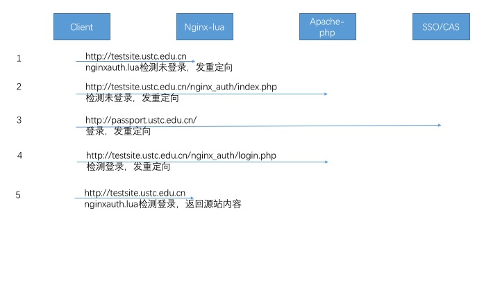

### 使用lua对反向代理做权限控制

为了安全考虑，部分网站在校内可以直接访问，校外访问时需先经过一次用户认证，从而避免把网站直接暴露到校外，减少一些非针对性的安全威胁。

原理：使用nginx lua中的access_by_lua功能，在每次访问时，通过lua程序判断是否允许访问。

```
1. 首先根据IP地址判断，如果在白名单内，直接返回源站内容。

2. 否则检查cookie是否有`nginx_auth_uid，nginx_auth_expire, nginx_auth_hash`三个参数，且`ngxi_auth_expire<当前时间`, 且`nginx_auth_hash = md5(nginx_auth_uid '|' nginx_auth_expire)`。
如果正确，说明是认证过的用户，返回源站内容。否则重定向到 `/nginx_auth/` 进行用户认证。

3. /nginx_auth/是一段php程序（也可以是其他认证）。完成用户认证后，将 `nginx_auth_uid，nginx_auth_expire, nginx_auth_hash` 写入cookie。

4. 认证后重定向到之前访问的URL（next参数），这时因为cookie中有个三个参数的信息，经过检查后会返回源站内容。
```

致谢：代码参考了 https://github.com/StephenPCG/nginx-lua-simpleauth-module




